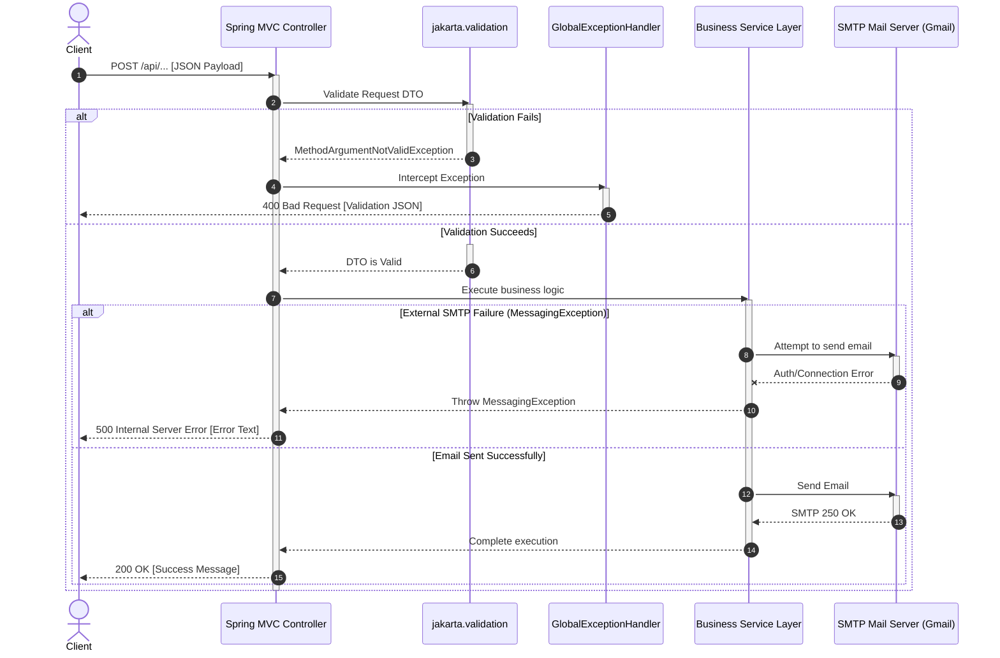

# 📡 AutoMailer API Specification

This document details the HTTP API endpoints exposed by the **AutoMailer** (MailZero) service. The service operates by default on port `8080` and implements structured validation, detailed log tracing, and standardized error formats.

---

## 🗺️ API Endpoint Summary

The application exposes the following endpoints:

| Endpoint | Method | Authentication | Description | Class Handler |
| :--- | :--- | :--- | :--- | :--- |
| `/api/otp/generateOTP` | `POST` | None | Generates a secure 6-digit OTP and sends it via email. | `OtpController` |
| `/api/otp/verify` | `POST` | None | Validates the provided OTP against the stored code. | `OtpController` |
| `/api/welcome` | `POST` | None | Dispatches a welcome email to new users. | `WelcomeController` |
| `/reset-password` | `POST` | None | Dispatches a password reset link with token verification. | `ResetPasswordController` |

---

## 🔀 Generic Request Flow

The following sequence diagram outlines how incoming API requests are processed through the Spring Boot validation, exception handling, and service layers.



---

## 📡 Endpoint Details

### 1️⃣ Generate OTP
Generates a cryptographically secure 6-digit OTP, stores it in-memory with a 5-minute expiry timestamp, and dispatches an HTML email containing the code.

*   **URL Path:** `/api/otp/generateOTP`
*   **HTTP Method:** `POST`
*   **Content-Type:** `application/json`

#### Request Payload
```json
{
  "email": "user@example.com",
  "phoneNumber": "+1234567890"
}
```

#### Field Specifications & Validation Rules
| Field | Type | Required | Validation Rules | Description |
| :--- | :--- | :--- | :--- | :--- |
| `email` | String | **Yes** | `@NotBlank`, `@Email` | The recipient's email address. |
| `phoneNumber` | String | No | None | Optional phone number field (retained for future multi-channel expansion; currently unused). |

#### Responses

##### 🟢 200 OK (Success)
*   **Content-Type:** `text/plain`
*   **Body:**
    ```text
    OTP sent successfully to user@example.com
    ```

##### 🔴 400 Bad Request (Validation Failure)
*   **Content-Type:** `application/json`
*   **Body:**
    ```json
    {
      "timestamp": "2026-05-20T10:45:12.345",
      "status": 400,
      "error": "Validation Failed",
      "errors": {
        "email": "Invalid email format"
      }
    }
    ```

##### 🔴 500 Internal Server Error (Mail Server Failure)
*   **Content-Type:** `text/plain`
*   **Body:**
    ```text
    Failed to send OTP: Mail server connection failed; nested exception is jakarta.mail.MessagingException: Unknown SMTP host: smtp.gmail.com
    ```

---

### 2️⃣ Verify OTP
Validates the provided OTP code against the active, in-memory OTP cache. If the OTP is correct and has not exceeded its 5-minute lifespan, validation succeeds.

*   **URL Path:** `/api/otp/verify`
*   **HTTP Method:** `POST`
*   **Content-Type:** `application/json`

#### Request Payload
```json
{
  "email": "user@example.com",
  "otp": "857412"
}
```

#### Field Specifications & Validation Rules
| Field | Type | Required | Validation Rules | Description |
| :--- | :--- | :--- | :--- | :--- |
| `email` | String | **Yes** | `@NotBlank`, `@Email` | The recipient's email address. |
| `otp` | String | **Yes** | `@NotBlank` | The 6-digit OTP code to verify. |

#### Responses

##### 🟢 200 OK (Verification Success)
*   **Content-Type:** `text/plain`
*   **Body:**
    ```text
    OTP verified successfully
    ```

##### 🔴 400 Bad Request (Invalid or Expired OTP)
*   **Content-Type:** `text/plain`
*   **Body:**
    ```text
    Invalid or expired OTP
    ```

##### 🔴 400 Bad Request (Validation Failure)
*   **Content-Type:** `application/json`
*   **Body:**
    ```json
    {
      "timestamp": "2026-05-20T10:48:00.123",
      "status": 400,
      "error": "Validation Failed",
      "errors": {
        "otp": "OTP is required"
      }
    }
    ```

---

### 3️⃣ Send Welcome Email
Sends a stylized welcome email notifying a user that their registration or onboarding on the platform is complete.

*   **URL Path:** `/api/welcome`
*   **HTTP Method:** `POST`
*   **Content-Type:** `application/json`

#### Request Payload
```json
{
  "email": "user@example.com",
  "name": "Jane Doe"
}
```

#### Field Specifications & Validation Rules
| Field | Type | Required | Validation Rules | Description |
| :--- | :--- | :--- | :--- | :--- |
| `email` | String | **Yes** | `@NotBlank`, `@Email` | The user's registered email address. |
| `name` | String | **Yes** | `@NotBlank`, `@Size(max = 100)` | The user's name for email personalization. Max 100 characters. |

#### Responses

##### 🟢 200 OK (Success)
*   **Content-Type:** `text/plain`
*   **Body:**
    ```text
    Welcome email sent!
    ```

##### 🔴 500 Internal Server Error (Mail Server Failure)
*   **Content-Type:** `text/plain`
*   **Body:**
    ```text
    Failed to send email: Authentication failed; nested exception is jakarta.mail.AuthenticationFailedException
    ```

---

### 4️⃣ Send Password Reset Email
Sends a transactional email containing a password reset token and full URL. The reset link is assembled by integrating the base reset URL with the generated token.

*   **URL Path:** `/reset-password`
*   **HTTP Method:** `POST`
*   **Content-Type:** `application/json`

#### Request Payload
```json
{
  "email": "user@example.com",
  "resetToken": "a6f8b2d1c9e34586",
  "resetLink": "https://example.com/reset-password",
  "name": "Jane Doe"
}
```

#### Field Specifications & Validation Rules
| Field | Type | Required | Validation Rules | Description |
| :--- | :--- | :--- | :--- | :--- |
| `email` | String | **Yes** | `@NotBlank`, `@Email` | The account owner's email address. |
| `resetToken` | String | **Yes** | `@NotBlank`, `@Size(min = 6, max = 64)` | The secure token, between 6 and 64 characters long. |
| `resetLink` | String | **Yes** | `@NotBlank` | The base reset URL. The controller automatically appends `?token={resetToken}` to compose the absolute path. |
| `name` | String | No | None | Optional username for personalizing the reset greeting. |

#### Responses

##### 🟢 200 OK (Success)
*   **Content-Type:** `text/plain`
*   **Body:**
    ```text
    Password reset email sent successfully to user@example.com
    ```

##### 🔴 400 Bad Request (Validation Failure)
*   **Content-Type:** `application/json`
*   **Body:**
    ```json
    {
      "timestamp": "2026-05-20T10:52:14.999",
      "status": 400,
      "error": "Validation Failed",
      "errors": {
        "resetToken": "Reset token must be between 6 and 64 characters"
      }
    }
    ```

---

## 🛡️ Error Handling System

AutoMailer leverages `@RestControllerAdvice` inside `GlobalExceptionHandler` to translate thrown exceptions into structured JSON responses. This standardizes client integration and prevents technical stack traces from leaking to the caller.

### Common Validation Error Model (`400 Bad Request`)
```json
{
  "timestamp": "2026-05-20T10:45:12.345",
  "status": 400,
  "error": "Validation Failed",
  "errors": {
    "field_name_1": "Error explanation message 1",
    "field_name_2": "Error explanation message 2"
  }
}
```

### Generic Server Error Model (`500 Internal Server Error`)
```json
{
  "timestamp": "2026-05-20T10:55:00.001",
  "status": 500,
  "error": "Internal Server Error",
  "message": "Detailed description of the underlying fault"
}
```
