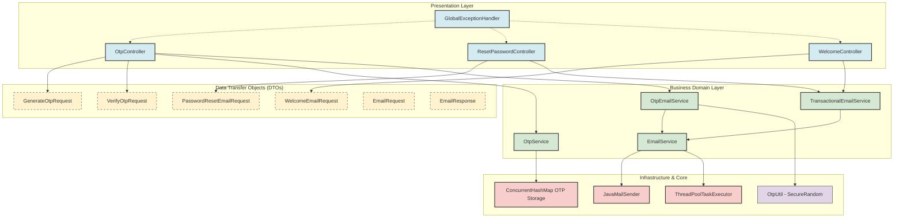
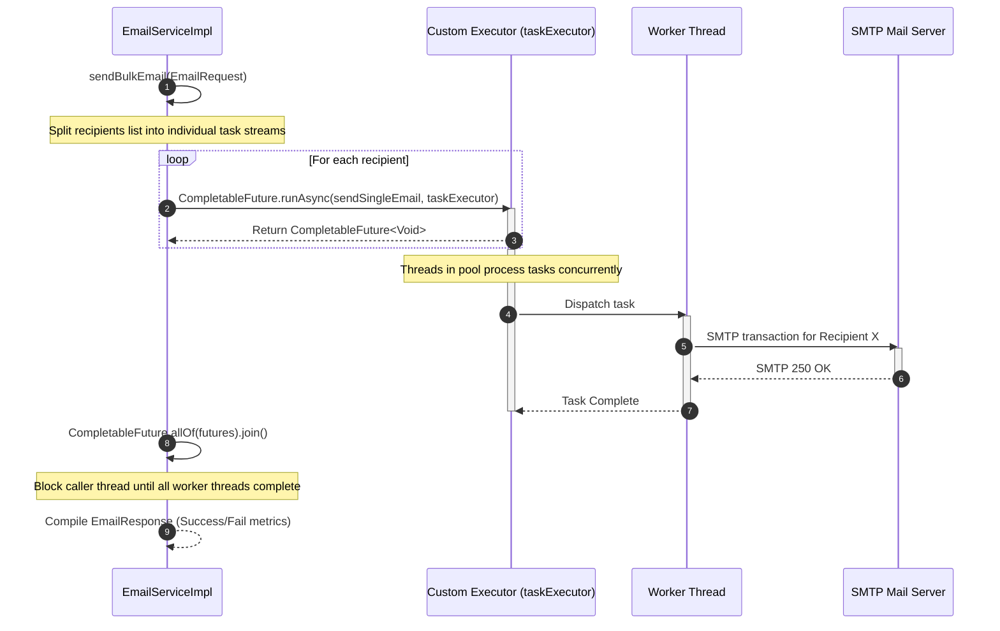
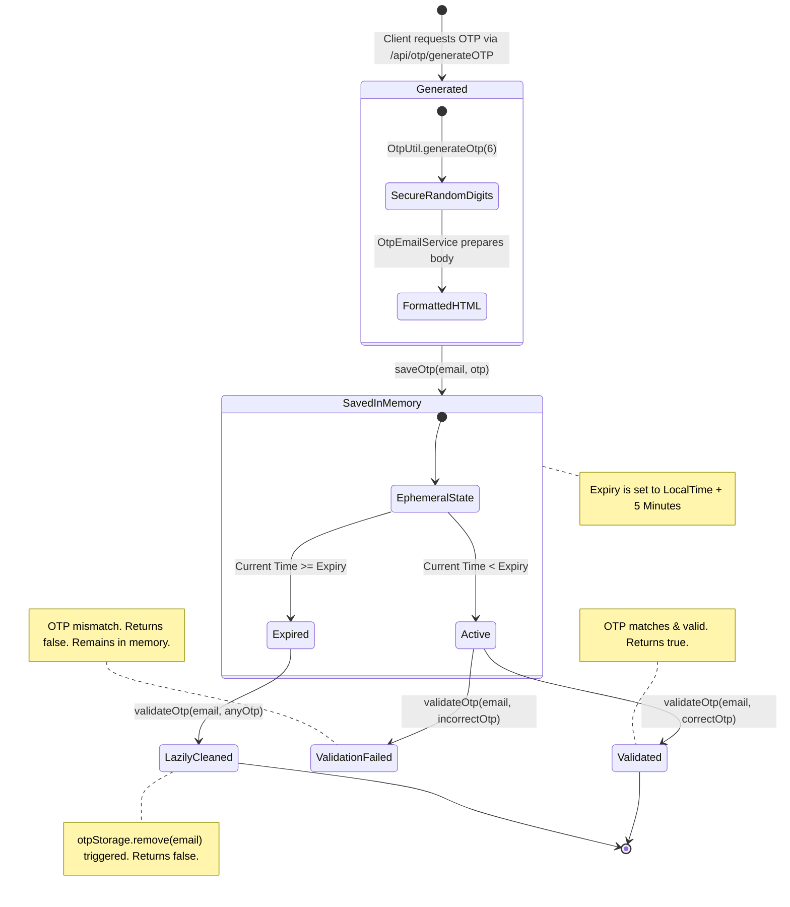

# 🧱 Architecture & System Design

This document details the software architecture, component hierarchies, thread pooling strategies, and data structures utilized in the **AutoMailer** (MailZero) system.

---

## 🏗️ Architecture Design Overview

AutoMailer is built as a layered, decoupled service leveraging the **Spring Boot** framework. It adheres to clean architecture principles by separating the REST controllers (Presentation), Data Transfer Objects (Payloads), Business Services (Domain Logic), and Infrastructure (SMTP Client, Multithreading, In-Memory Storage).



---

## ⚡ Thread Pool Configuration & Async Processing

To prevent incoming HTTP request threads from blocking during SMTP operations (which are network-bound and notoriously slow), AutoMailer supports asynchronous execution pipelines.

### ⚙️ Customized Executor Configuration (`EmailConfig.java`)
The application defines a custom `ExecutorService` bean named `taskExecutor` that configures a customized `ThreadPoolTaskExecutor`:

*   **Core Pool Size:** `10` threads (always kept active and running).
*   **Maximum Pool Size:** `20` threads (the upper boundary of concurrent threads under heavy load).
*   **Queue Capacity:** `100` tasks (excess requests are buffered here when all core threads are busy).
*   **Thread Prefix:** `email-exec-` (for distinct trace logging and simplified thread auditing).
*   **Annotation Drivers:** `@EnableAsync` configures the Spring context to support asynchronous method boundary executions.

### 💨 Asynchronous Bulk Processing Pipeline
For processing bulk mailing requests efficiently, `EmailServiceImpl` executes tasks asynchronously using `CompletableFuture.runAsync()` backed by the custom execution pool.



---

## 🔐 OTP Lifecycle & In-Memory Storage

AutoMailer manages OTP lifecycles entirely in-memory using an ephemeral cache pattern. This avoids database overhead while maintaining strict concurrency safety.

### 💾 Data Structure: `OtpServiceImpl`
OTP cache records are kept in a concurrent-safe storage map:
```java
private final ConcurrentHashMap<String, OtpData> otpStorage = new ConcurrentHashMap<>();
```
Each entry maps an `email` (key) to an instance of `OtpData`, which is a lightweight, immutable Java `record`:
```java
private record OtpData(String otp, LocalDateTime expiry) {}
```

### ⏳ OTP Lifecycle States & Transitions
An OTP transition has three key stages: Generation, Ephemeral Storage, and Verification/Expiry Cleanup.



### 🛡️ Secure OTP Generation
OTP digits are compiled using a secure random generator inside `OtpUtil.java`:
```java
private static final SecureRandom random = new SecureRandom();
```
By utilizing `SecureRandom` instead of `java.util.Random`, generated OTPs are cryptographically strong and resistant to sequence predictability attacks.

---

## 🕵️ Logs & PII (Personally Identifiable Information) Safeguards

To conform to standard privacy mandates (e.g., GDPR, CCPA) and security best practices, the system prevents plaintext email addresses from leaking into stdout or files.

### 🛡️ Email Masking Helper
The `OtpEmailServiceImpl` implements a masking method (`maskEmail`) before generating `INFO` level statements:

*   **Logic:**
    *   If the email string is null or does not contain `@`, it is returned unchanged.
    *   If the local part (before `@`) is **2 characters or fewer**, it is entirely replaced with asterisks (e.g., `***@domain.com`).
    *   If the local part is **longer than 2 characters**, the system preserves only the first and last character of the local part, replacing all intermediate characters with `***` (e.g., `j***e@domain.com`).

*   **Example Output:**
    *   `vne.vvm@gmail.com` ➔ `v***m@gmail.com`
    *   `me@vvm.in` ➔ `***@vvm.in`
