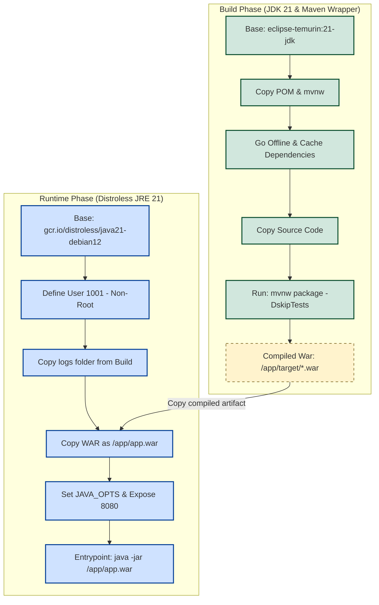

# 🐳 Deployment & Containerization

This document details the containerization strategy, runtime environment configurations, environment variables, security hardening measures, and deployment workflows for the **AutoMailer** (MailZero) application.

---

## 🏗️ Multi-Stage Dockerfile Strategy

AutoMailer uses a **multi-stage Docker build** process inside `Dockerfile`. This pattern guarantees that build-time compilers and dependencies (like Maven and the JDK package) are excluded from the final execution image, resulting in a lightweight, secure, and production-ready runtime container.



---

## 🛡️ Container Security Hardening

### 1️⃣ Google Distroless Runtime Base
The final stage of the build inherits from:
`gcr.io/distroless/java21-debian12`

*   **What is Distroless?**
    Distroless images contain *only* the application and its runtime dependencies. They do **not** contain package managers, shell interpreters (`/bin/sh` or `/bin/bash`), or typical system utilities.
*   **Security Advantages:**
    *   **Reduced Attack Surface:** Attackers cannot invoke shell commands or download external exploit packages (e.g., via `curl` or `wget`) even if an application-level remote code execution (RCE) vulnerability is discovered.
    *   **Smaller Footprint:** Reduces image size down to the absolute bare minimum, improving download speeds and startup times.
    *   **Compliance:** Eases container auditing and vulnerability scanning since there are no operating system packages to trigger false-positive warnings.

### 2️⃣ Rootless Execution
By default, Docker containers run as the root user (`UID 0`), which poses a major security hazard. If a container breakout exploit occurs, the attacker gains full root clearance on the host machine.
AutoMailer secures the container by executing as a non-privileged user:
```dockerfile
USER 1001
```
*   **Directory Permissions:** During the build stage, the directory `/app/logs` is pre-created and ownership is explicitly handed over to user `1001`:
    ```dockerfile
    RUN mkdir -p /app/logs && chown -R 1001:1001 /app/logs
    ```
*   This grants the rootless Java process permissions to read, write, and rotate logs without requiring elevated system root privileges.

---

## ⚙️ Docker Compose & Service Configuration

The `compose.yaml` file configures the AutoMailer container service for runtime deployment, binding port interfaces, configuring SMTP details, and setting system health checks.

### 📄 Configuration Breakdown
```yaml
services:
  auto-mailer:
    build: .
    container_name: auto-mailer
    ports:
      - "8080:8080"
    environment:
      JAVA_OPTS: -Xms256m -Xmx512m
      SPRING_MAIL_HOST: smtp.gmail.com
      SPRING_MAIL_PORT: 587
      SPRING_MAIL_USERNAME: ${EMAIL}
      SPRING_MAIL_PASSWORD: ${EMAIL_PASSWORD}
      SPRING_MAIL_PROPERTIES_MAIL_SMTP_AUTH: "true"
      SPRING_MAIL_PROPERTIES_MAIL_SMTP_STARTTLS_ENABLE: "true"
    healthcheck:
      test: [ "CMD", "curl", "-f", "http://localhost:8081/actuator/health" ]
      interval: 30s
      timeout: 5s
      retries: 3
    deploy:
      resources:
        limits:
          cpus: "0.5"
          memory: "512M"
```

### 📈 Deployment Parameters Explained
*   **Resource Boundaries (`deploy.resources.limits`):**
    *   **CPUs:** `0.5` (limits container execution capacity to a maximum of half a CPU core).
    *   **Memory:** `512M` (prevents memory leak exhaustion by constraining memory consumption, matching the max Java heap space).
*   **JVM Tuning (`JAVA_OPTS`):**
    *   `-Xms256m`: Standardizes initial memory heap allocation at 256MB.
    *   `-Xmx512m`: Caps the maximum memory heap allocation at 512MB to align with resource limits and prevent out-of-memory container terminations.
    *   `-XX:MaxRAMPercentage=80.0`: Automatically scales JVM memory usage based on container constraints.
    *   `-Djava.security.egd=file:/dev/./urandom`: Configures the JVM to use a non-blocking random entropy source. This accelerates cryptographic generations in rootless setups.
*   **Active Healthcheck:**
    *   Monitors `/actuator/health` every 30 seconds to track application status. If the application becomes unresponsive or encounters structural startup failures, Docker will mark the container as unhealthy and attempt container restoration.

---

## 🔑 Environment & Secrets Configuration

All secret values are externalized into a `.env` file, which is loaded by Docker Compose at startup. This prevents critical system credentials from being committed to public version control systems.

### 📝 Example `.env` Template
Create a file named `.env` in the root of the project:
```env
EMAIL=sender@example.com
EMAIL_PASSWORD=your_app_specific_smtp_password
```

### 🔒 Hardening Recommendations for Production
1.  **Git Inclusions:** Keep `.env` listed in `.gitignore` at all times to prevent leakages.
2.  **SMTP App-Specific Passwords:** For providers like Gmail, do not use your primary Google Account password. Instead, set up an **App Password** through Google Account Settings to restrict scope specifically to SMTP access.
3.  **Secret Managers:** In enterprise production setups (Kubernetes, AWS ECS, GCP Cloud Run), completely replace the `.env` file with native secret injectors (e.g., Vault, AWS Secrets Manager, or Google Secret Manager) to dynamically feed variables directly to the container runtime.

---

## 🪵 Log Management

System logs are captured using the Logback configuration inside `application.properties`:
```properties
logging.file.name=/app/logs/QBroker.log
logging.logback.rollingpolicy.max-file-size=10MB
logging.logback.rollingpolicy.max-history=30
```

### 📁 Log Mount Configuration
Because containers have ephemeral file systems, logs inside `/app/logs/` will be deleted when the container restarts. To persist these logs, mount a host directory to the container logs folder inside `compose.yaml`:
```yaml
    volumes:
      - ./logs:/app/logs
```
*   This mapping binds the local host directory `./logs` to `/app/logs`, ensuring log outputs persist across container rebuilds and updates.
